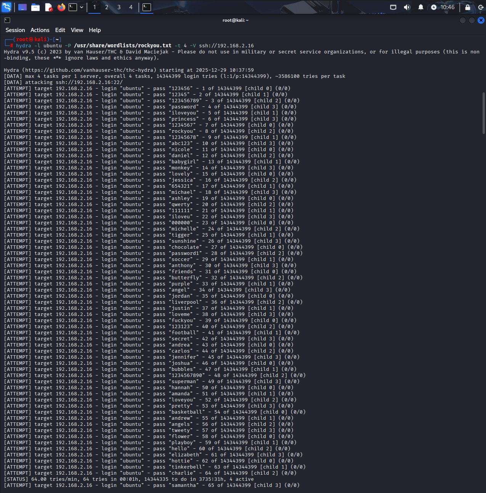
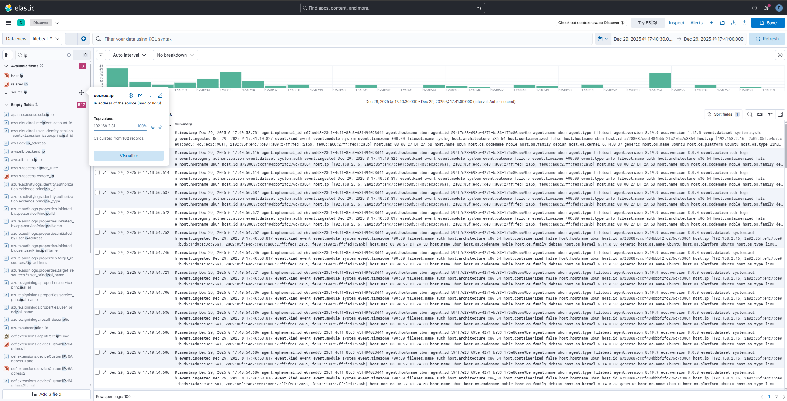

# 🛡️ Real-Time SSH Brute Force Detection (ELK Stack)

## 📌 Project Overview
In this project, I configured an **ELK Stack** (Elasticsearch, Logstash, Kibana) to monitor an Ubuntu server. I simulated a **Brute Force attack** using Hydra from a Kali Linux machine to test the detection capabilities of the stack.

## 🚀 Lab Setup
- **Target**: Ubuntu Server 24.04 (IP: 192.168.2.16)
- **Attacker**: Kali Linux (IP: 192.168.2.31)
- **Tools**: Filebeat (Log Collection), Elasticsearch (Backend), Kibana (Visualization)

### ⚔️ The Attack (Red Team)
To simulate a real-world brute force scenario, I used **Hydra** from my Kali Linux machine. 

**Command used:**
```bash
hydra -l ubuntu -P /usr/share/wordlists/rockyou.txt -t 4 -V ssh://192.168.2.16


## 📊 Detection & Analysis
### 1. Attack Visualization
Immediately after launching Hydra, the Kibana Dashboard showed a significant spike in failed SSH login attempts.


### 2. Attacker Identification
Using **Kibana Discover**, I filtered the logs and identified the source IP of the attacker.
- **Attacker IP**: `192.168.2.31`
- **Target Account**: `ubuntu`


## 🔐 Mitigation (Next Steps)
To secure the server, I implemented:
1. **Fail2Ban**: Automatically bans IPs after 5 failed attempts.
2. **SSH Key Authentication**: Disabling password logins to prevent brute force entirely.